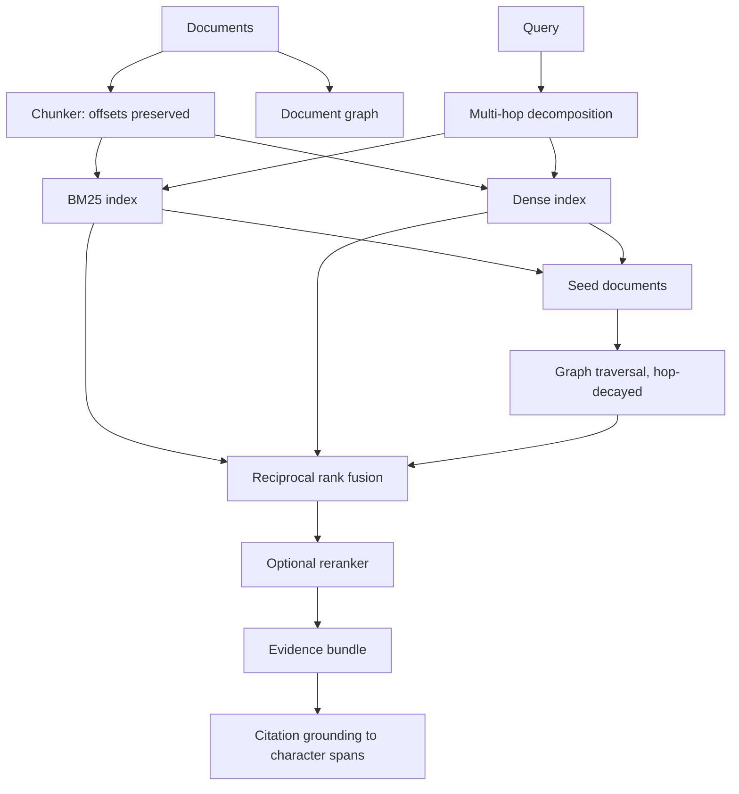

# graph-context-engine

Hybrid retrieval over text and a document graph. BM25, dense vectors and graph traversal run as independent channels, fused by reciprocal rank, with multi-hop query decomposition and citation grounding down to character offsets.

The question it exists to answer: *what does a retrieval system need beyond vector search?* Three things, and each is a separate channel here — exact lexical matching for identifiers and rare terms, dense similarity for paraphrase, and structural traversal for facts that live one hop away from anything the query mentions.

## Architecture



## Why reciprocal rank fusion

The channels produce incomparable numbers. BM25 is unbounded and corpus-dependent, cosine similarity sits in [-1, 1], graph proximity is a decayed hop count. Normalising them onto a shared scale requires assumptions that break whenever the corpus changes — and break silently.

RRF uses only rank position, so it needs no such assumption. There is a test asserting that a BM25 score of 10,000 does not outrank a document that two other channels agree on.

## Citation grounding

Chunks keep character offsets into their source document. A `Citation` names the document, the chunk and the exact span, so verifying an answer is a string comparison rather than an act of trust:

```python
bundle.verify_all(documents)
# {"total": 3, "unverifiable": [], "all_verified": True}
```

A sentence with no sufficiently overlapping source gets **no citation**. Silence is the correct output when nothing supports a claim; inventing an approximate match is the specific failure this guards against.

## Multi-hop

Two patterns are recognised deterministically:

- coordination — "find X and then find Y" → independent sub-queries
- relative clause — "which store backs the component that the policy depends on" → resolve the clause first, then feed its results in as graph seeds for the head

The decomposer is rule-based. An LLM decomposer would make every test here non-reproducible; `multihop.py` is where one would be substituted.

## Quickstart

```bash
python3 -m venv .venv && source .venv/bin/activate
pip install -e ".[dev]"
pytest
python examples/hybrid_search.py
python examples/multi_hop.py
python examples/grounded_answer.py
gce benchmark
```

CLI:

```bash
gce search "what prevents a duplicated side effect"
gce search "which store backs the component the policy depends on" --explain
gce graph --format mermaid
gce benchmark --out benchmarks/results.json
gce capabilities
```

## Embedders

`Embedder` is a four-method protocol. Two implementations ship:

| Embedder | Semantic | Runs in CI | Purpose |
|---|---|---|---|
| `HashingEmbedder` | **no** | yes | Deterministic vectors so the dense channel and fusion are testable offline |
| `MLXImageEmbedder` | yes | **no** | CLIP-style joint text/image via MLX on Apple Silicon |

`is_semantic` is part of the protocol, so a result file records which kind produced it. `HashingEmbedder` produces stable, unit-length vectors and honest cosine scores, but it carries no semantics — it will not match "car" to "automobile", and nothing here claims it does.

## Multimodal status: not validated

`MLXImageEmbedder` is written against the mlx-vlm API and **has never been executed**. MLX requires Apple Silicon; this package was developed on x86 Linux where `import mlx` fails.

That is enforced in code, not just stated here. `available()` probes the real import and every method raises `BackendUnavailable` when it fails. There is deliberately **no fallback path** that quietly produces vectors from something else — a silent fallback is how a caller ends up believing multimodal retrieval was validated when it was not.

```bash
./scripts/validate_multimodal_mac.sh    # refuses to run on non-arm64
```

Until that passes on a Mac, this repository claims no multimodal semantic result and ships no multimodal benchmark file.

## Benchmark

Eight documents, ten labelled queries, two of them multi-hop, with ground-truth relevant documents assigned by hand.

```bash
gce benchmark
```

Measures Recall@1/3/5, MRR and nDCG@5, plus multi-hop path correctness and citation attribution. Results depend on the embedder in use; with `HashingEmbedder` the dense channel contributes lexical signal only, and the benchmark output records `embedder_is_semantic: false` so the numbers are read correctly.

This is a fixture set for exercising the pipeline and catching regressions. Eight documents is not an information-retrieval evaluation, and no comparison to a published benchmark is offered.

## Limitations

- Exact nearest-neighbour search, no ANN index. Correct at fixture scale; wrong at real scale, where an ANN index and its recall caveat become necessary.
- No semantic embedder runs in CI, so semantic retrieval quality is untested here.
- The reranker default is lexical overlap, and reports `is_model_based: false`. A cross-encoder would slot into the same interface.
- Rule-based decomposition handles two syntactic patterns and will not decompose an arbitrary compositional question.
- Mention extraction is title-substring matching, ignoring titles shorter than two words. Conservative by design: traversal amplifies a wrong edge.
- Citation grounding is lexical overlap, not entailment. It confirms a sentence came from somewhere, not that the source actually supports the claim.
- In-memory only. No persistence, no incremental index updates.

## Reproducing the accepted state

```bash
pytest -q && ruff check . && gce benchmark
```

## Licence

Apache-2.0.
