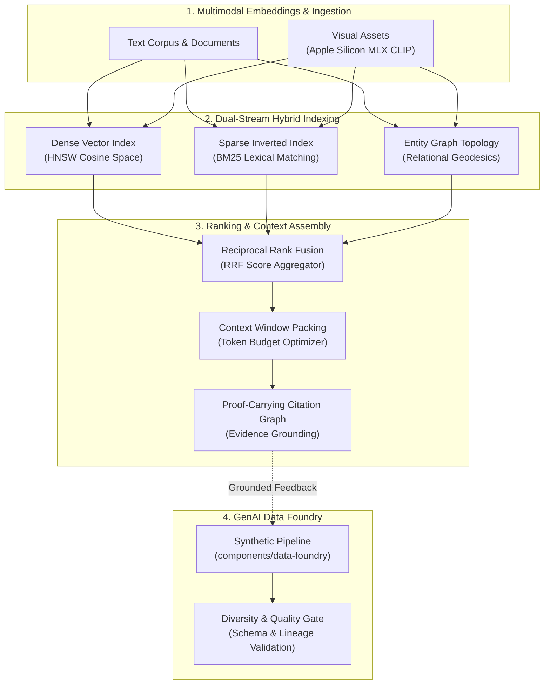

# Multimodal Context Systems: Hybrid Graph Retrieval & Data Foundry

[](LICENSE)
[](scripts/verify_all.sh)
[](#architecture--subsystems)
[](#1-componentscontext-engine--hybrid-graph-context-engine)
[](scripts/verify_all.sh)
[](https://x.com/SupratikSarkar_)

> **High-throughput hybrid graph retrieval, evidence-grounded context assembly, and provenance-aware GenAI data synthesis pipelines with native Apple Silicon MLX acceleration.**

---

## Overview

Modern generative AI applications struggle with two interrelated data challenges:
1. **Context Fragmentation**: Vector search alone misses structural relationships, multi-hop entity connections, and precise lexical matches, resulting in incomplete context windows and hallucinated summaries.
2. **Data Provenance & Quality**: Synthetic data generation pipelines often lack strict schema validation, lexical diversity guardrails, and cryptographic lineage tracking.

**`multimodal-context-systems`** resolves these bottlenecks by pairing a high-throughput hybrid retrieval engine with an evidence-grounded context assembly pipeline and a verifiable synthetic data foundry.

```
+-------------------------------------------------------------------------------------------------+
|                                 MULTIMODAL CONTEXT SYSTEMS                                      |
|                                                                                                 |
|   +------------------------------------+             +--------------------------------------+   |
|   |     components/context-engine      |             |       components/data-foundry        |   |
|   |  Hybrid Graph + Vector Retrieval   | <=========> |     Synthetic Dataset Synthesis      |   |
|   |  BM25, Dense Vector, RRF, MLX CLIP |             |     Schema Governance, Data Lineage  |   |
|   +------------------------------------+             +--------------------------------------+   |
|                     |                                                    |                      |
|                     +--------------------------+-------------------------+                      |
|                                                |                                                |
|                                                v                                                |
|   +-----------------------------------------------------------------------------------------+   |
|   |                                legacy/ (Historical Foundations)                         |   |
|   |         Multimodal StackGAN (Text-to-Image) | Signature Similarity (Biometrics)         |   |
|   +-----------------------------------------------------------------------------------------+   |
+-------------------------------------------------------------------------------------------------+
```



---

## Architecture & Subsystems

### 1. `components/context-engine` — Hybrid Graph Context Engine
* **Directory**: [`components/context-engine`](components/context-engine/)
* **Core Capabilities**:
  - **Dual-Stream Retrieval**: Combines dense semantic vector embeddings with sparse BM25 inverted indexes.
  - **Reciprocal Rank Fusion (RRF)**: Merges heterogeneous rank lists using normalized reciprocal position weighting:
    $$RRF(d) = \sum_{m \in M} \frac{1}{k + r_m(d)}$$
  - **Apple Silicon Native MLX**: Hardware-accelerated multimodal image/text embedding via MLX (`mlx-community/clip-vit-base-patch32`) for sub-millisecond local latency on macOS workstations.
  - **Evidence Grounding**: Attaches precise paragraph and chunk citations to assembled contexts, enabling downstream verification and hallucination auditing.

### 2. `components/data-foundry` — Provenance-Aware GenAI Data Foundry
* **Directory**: [`components/data-foundry`](components/data-foundry/)
* **Core Capabilities**:
  - Multi-stage synthetic prompt-response pair generation with strict JSON schema enforcement.
  - Lexical diversity analysis (n-gram entropy, Type-Token Ratio) preventing dataset collapse.
  - Cryptographic content hash chaining ensuring complete auditability from raw seeds to final dataset shards.

### 3. `legacy/` — Historical Deep-Learning Lineage
* **Directory**: [`legacy`](legacy/)
* **Foundational Modules**:
  - `multimodal-stackgan`: Historical multi-stage conditional generative adversarial network (GAN) for text-to-image synthesis.
  - `signature-similarity`: Siamese convolutional network architecture for offline biometric signature verification and visual representation learning.

---

## Capability Matrix

| Feature | `components/context-engine` | `components/data-foundry` |
| :--- | :---: | :---: |
| **Dense Vector Retrieval** | **Yes** (HNSW / Cosine) | No |
| **Sparse BM25 Search** | **Yes** (BM25Okapi) | No |
| **Reciprocal Rank Fusion (RRF)** | **Yes** | No |
| **Apple Silicon (MLX) Acceleration**| **Native** | No |
| **Citation Attribution** | **Strict Graph Links** | Provenance Tags |
| **Synthetic Data Generation** | No | **Yes** |
| **Schema Governance & Validation** | Output Schemas | **Pydantic v2 Gates** |
| **Unit & Integration Tests** | **38 Passing** | **41 Passing** |

---

## Quick Start & Verification

### 1. Unified Verification Suite
The umbrella repository provides a turnkey verification harness that validates both active components across isolated test environments:

```bash
# Clone the repository
git clone https://github.com/supratik-sarkar/multimodal-context-systems.git
cd multimodal-context-systems

# Execute root verification suite (requires Python 3.12.13)
bash scripts/verify_all.sh
```

### 2. Standalone Component Usage
Each subsystem is modular and self-contained:

```bash
# Set up and test Context Engine
cd components/context-engine
pip install -e ".[dev]"
pytest tests/ -q

# Set up and test Data Foundry
cd ../data-foundry
pip install -e ".[dev]"
pytest tests/ -q
```

---

## Repository Structure

```text
multimodal-context-systems/
├── components/
│   ├── context-engine/       # Hybrid graph + vector search, BM25, RRF, MLX CLIP
│   └── data-foundry/         # Synthetic dataset generation, schema curation, lineage
├── legacy/
│   ├── multimodal-stackgan/  # Historical text-to-image conditional GAN lineage
│   └── signature-similarity/ # Historical Siamese biometric visual networks
├── scripts/
│   └── verify_all.sh         # Unified verification runner across active components
├── HISTORY.md                # Provenance records and component merge history
├── LICENSE                   # Apache License 2.0
└── LICENSES.md               # Upstream licensing documentation
```

---

## Portfolio Navigation

Part of the **Engineering & Systems Portfolio** by [Supratik Sarkar](https://github.com/supratik-sarkar):
* [multimodal-context-systems](https://github.com/supratik-sarkar/multimodal-context-systems) — Context assembly, graph retrieval, and multimodal grounding.
* [agentic-ai-systems](https://github.com/supratik-sarkar/agentic-ai-systems) — Resilient agent runtimes, checkpointing, and protocol gateways.
* [training-inference-systems](https://github.com/supratik-sarkar/training-inference-systems) — Accelerated training primitives and hardware-conscious inference.
* [applied-ml-systems](https://github.com/supratik-sarkar/applied-ml-systems) — Anomaly detection, optimization, and recommendation engines.
* [StART](https://github.com/supratik-sarkar/StART) — Evidence-native model development and institutional review platform.
