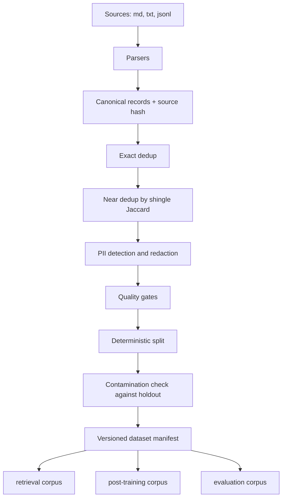

# genai-data-foundry

A data pipeline for GenAI corpora where every output record can name the file it came from and every transformation that touched it.

This is not generic ETL. The stages exist because of failure modes specific to training and retrieval data: near-duplicates that quietly overweight a document, evaluation text leaking into the training split and inflating every number downstream, personal data reaching a corpus that will be embedded and served, and low-quality text that costs context budget without carrying information.

Everything is deterministic. No model calls, no network, no randomness. The same inputs and the same config produce the same `content_digest`, which is what makes a dataset version meaningful rather than decorative.

## Pipeline



## Lineage

Every record carries `source_id`, `source_hash` and an ordered list of `Transformation` entries, each with a name, a version and the detail of what it did:

```json
{
  "record_id": "handbook#2",
  "source_id": "handbook.md",
  "source_hash": "9f2c...",
  "content_hash": "41ab...",
  "lineage": [
    {"name": "parse", "version": "1.0", "detail": {"parser": ".md"}},
    {"name": "exact_dedup", "version": "1.0", "detail": {"normalised_hash": "..."}},
    {"name": "pii_redaction", "version": "1.0",
     "detail": {"matches": {"email": 1}, "redacted": true}},
    {"name": "quality_gate", "version": "1.0", "detail": {"words": 31}}
  ]
}
```

Rejections are kept too. "Why is this document *not* in the training set?" is a question a data pipeline should be able to answer, so every dropped record is recorded with its stage, reason and detail in the manifest.

## Deterministic splits

Split membership is a hash of `(seed, record_id)`, not a shuffle. A record therefore stays in the same split when the corpus grows. A random split silently invalidates every historical comparison the moment new data arrives, and that failure is invisible unless you go looking for it.

Contamination checking runs *after* the split, comparing training records against the actual holdout text, and removes rather than warns — leakage inflates every downstream metric, so a warning nobody reads is the wrong default.

## Quickstart

```bash
python3 -m venv .venv && source .venv/bin/activate
pip install -e ".[dev]"
pytest
python examples/build_corpus.py
```

CLI:

```bash
gdf build examples/corpus --version v1 --out build/
gdf inspect build/manifest-v1.json
gdf diff build/manifest-v1.json build/manifest-v2.json
gdf scan-pii examples/corpus
```

## What each stage does and does not do

| Stage | Mechanism | Honest limit |
|---|---|---|
| Exact dedup | SHA-256 over whitespace-normalised lowercase text | Only byte-identical after normalisation |
| Near dedup | k-shingle Jaccard, default k=5, threshold 0.7 | Lexical. Catches boilerplate and light edits; **will not catch a genuine paraphrase** — that needs embeddings, which would make the stage non-deterministic |
| PII | Transparent regex rules in `PII_RULES` | Catches structured identifiers. **Misses names, addresses and anything context-dependent.** Not a compliance control |
| Contamination | Shingle overlap against holdout text | Same lexical limit as near dedup |
| Quality | Explicit thresholds: length, distinct-word ratio, non-alphabetic ratio | Heuristic, not a quality model |
| Hard negatives | Lexical similarity, excluding exact matches | Lexical negatives, not semantically mined ones |

The limits are in the table rather than buried, because a PII stage described without them invites exactly the wrong trust.

## Manifests and diffing

```bash
gdf diff build/manifest-v1.json build/manifest-v2.json
```

reports added, removed and unchanged record ids per split, and whether the content digest moved. The digest is order-independent over record content hashes, so reordering the source directory does not produce a spurious version change.

## Limitations

- Text only. No PDF, HTML or image ingestion.
- In-memory. The whole corpus is held at once; this is sized for laptop-scale corpora, not for a distributed job.
- Shingle-based near-dedup is O(n²) in record count. Fine for thousands, wrong for millions — an LSH index is the standard fix and is not implemented here.
- Synthetic data generation is not implemented. A deterministic fixture generator would demonstrate the plumbing without demonstrating anything about synthetic data quality.
- No storage backend. Manifests and records are JSON on local disk.

## Reproducing the accepted state

```bash
pytest -q && ruff check . && python examples/build_corpus.py
```

## Licence

Apache-2.0.
